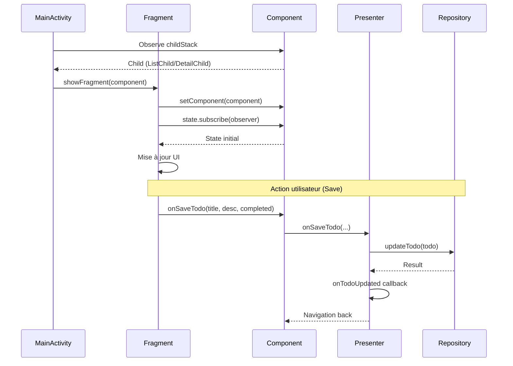
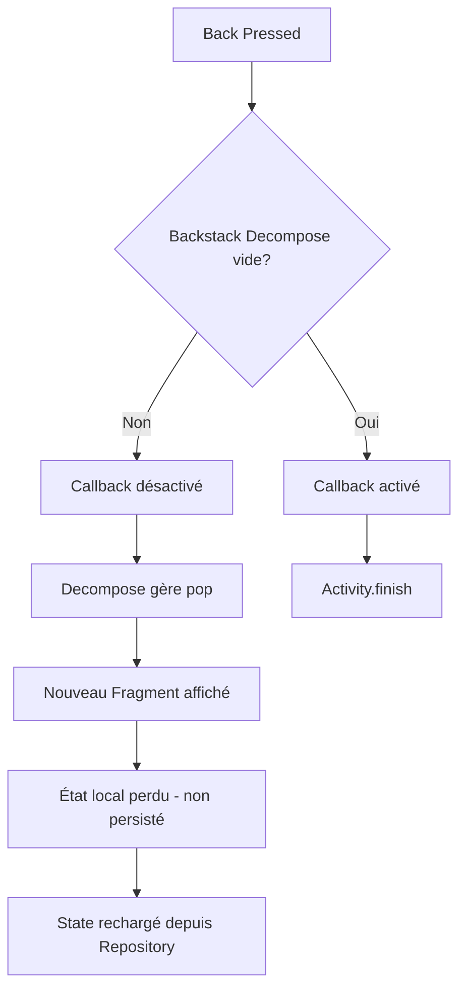
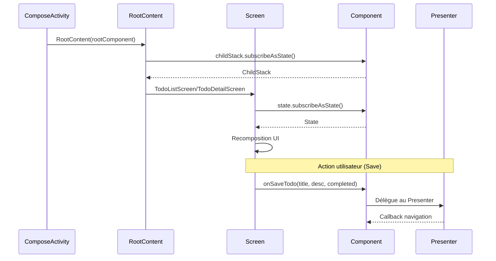
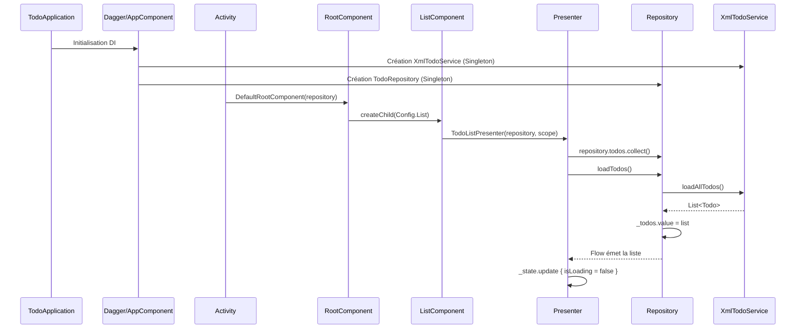
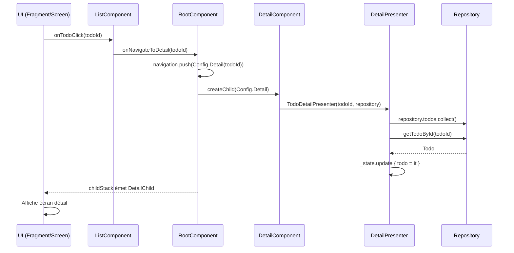
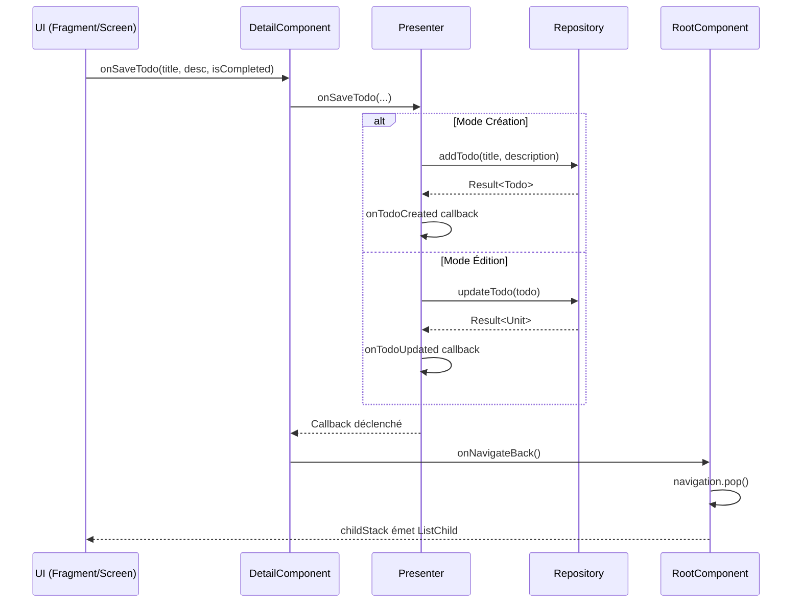
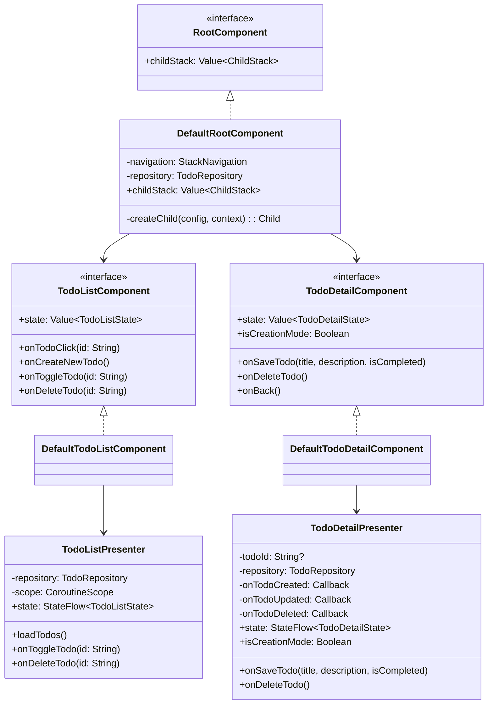
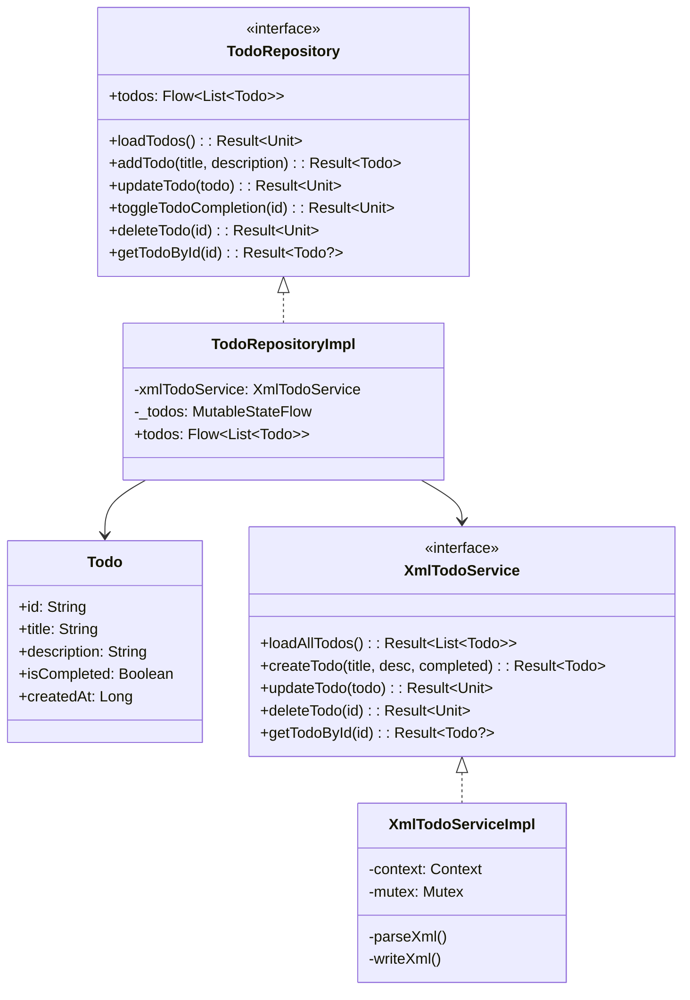
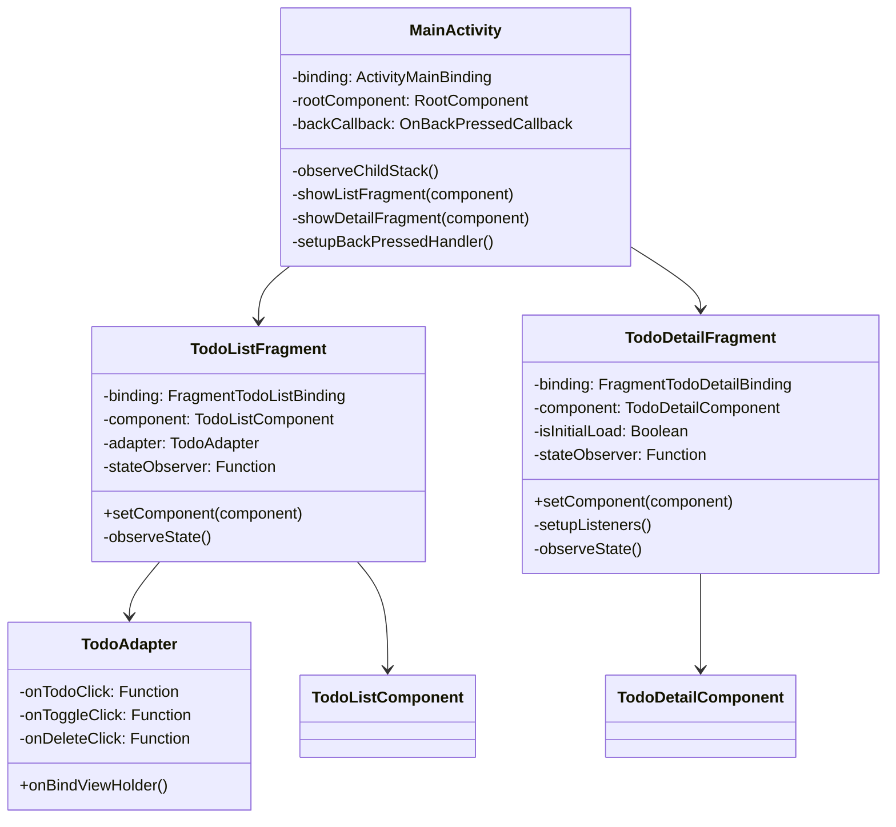
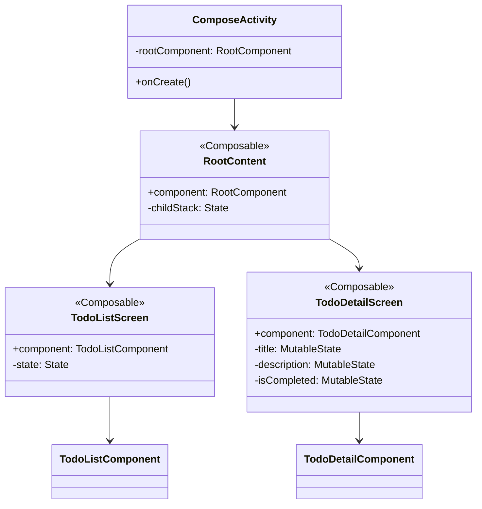

# TodoList - Application Android Multi-Architecture

Application de gestion de tâches démontrant deux approches d'architecture UI sur Android avec une couche métier partagée utilisant **Decompose** pour la navigation et la gestion d'état.

## Table des matières

- [Architecture Globale](#architecture-globale)
- [Architecture XML/Fragments](#architecture-xmlfragments)
- [Architecture Jetpack Compose](#architecture-jetpack-compose)
- [Flux d'Initialisation d'État](#flux-dinitialisation-détat)
- [Diagrammes de Classes](#diagrammes-de-classes)
- [Basculer entre les Architectures](#basculer-entre-les-architectures)
- [Structure du Projet](#structure-du-projet)
- [Technologies Utilisées](#technologies-utilisées)

---

## Architecture Globale

L'application utilise une architecture en couches avec séparation claire des responsabilités :

```
┌───────────────────────────────────────────────────────────┐
│                        UI Layer                           │
│  ┌───────────────────────┐  ┌───────────────────────────┐ │
│  │   XML/Fragments       │  │   Jetpack Compose         │ │
│  │   - MainActivity      │  │   - ComposeActivity       │ │
│  │   - TodoListFragment  │  │   - TodoListScreen        │ │
│  │   - TodoDetailFrag.   │  │   - TodoDetailScreen      │ │
│  └───────────────────────┘  └───────────────────────────┘ │
└───────────────────────────────────────────────────────────┘
                              │
                              ▼
┌───────────────────────────────────────────────────────────┐
│                   Presentation Layer                      │
│  ┌───────────────────────────────────────────────────────┐│
│  │                 Decompose Components                  ││
│  │   - RootComponent (Navigation Stack)                  ││
│  │   - TodoListComponent + Presenter                     ││
│  │   - TodoDetailComponent + Presenter                   ││
│  └───────────────────────────────────────────────────────┘│
└───────────────────────────────────────────────────────────┘
                              │
                              ▼
┌───────────────────────────────────────────────────────────┐
│                      Domain Layer                         │
│  ┌───────────────────────────────────────────────────────┐│
│  │   - Todo (Model)                                      ││
│  │   - TodoRepository (Interface)                        ││
│  └───────────────────────────────────────────────────────┘│
└───────────────────────────────────────────────────────────┘
                              │
                              ▼
┌───────────────────────────────────────────────────────────┐
│                       Data Layer                          │
│  ┌───────────────────────────────────────────────────────┐│
│  │   - TodoRepositoryImpl                                ││
│  │   - XmlTodoService (Persistance XML)                  ││
│  └───────────────────────────────────────────────────────┘│
└───────────────────────────────────────────────────────────┘
```

---

## Architecture XML/Fragments

### Composants Principaux

| Composant | Responsabilité |
|-----------|----------------|
| `MainActivity` | Héberge les Fragments, observe la ChildStack Decompose, gère le back |
| `TodoListFragment` | Affiche la liste avec RecyclerView, observe le state du Component |
| `TodoDetailFragment` | Formulaire d'édition/création, gère l'état local des champs |
| `TodoAdapter` | Adapter RecyclerView avec DiffUtil |

### Flux de Données



### Gestion du Back Button (XML)



### Gestion de l'État Local (XML)

```kotlin
// Fragment - État local pour les champs éditables
private var isInitialLoad = true

// Dans observeState()
if (isInitialLoad) {
    binding.titleEditText.setText(todo.title)
    binding.descriptionEditText.setText(todo.description)
    binding.statusCheckBox.isChecked = todo.isCompleted
    isInitialLoad = false
}
// Les modifications ne sont persistées qu'au clic sur Save
```

---

## Architecture Jetpack Compose

### Composants Principaux

| Composant | Responsabilité |
|-----------|----------------|
| `ComposeActivity` | Point d'entrée, initialise RootComponent |
| `RootContent` | Observe childStack, affiche le bon Screen |
| `TodoListScreen` | Composable liste avec LazyColumn |
| `TodoDetailScreen` | Composable formulaire avec état local (remember) |

### Flux de Données



### Gestion de l'État Local (Compose)

```kotlin
// États locaux pour les champs éditables
var title by remember(state.todo?.title) {
    mutableStateOf(state.todo?.title ?: "")
}
var description by remember(state.todo?.description) {
    mutableStateOf(state.todo?.description ?: "")
}
var isCompleted by remember(state.todo?.isCompleted) {
    mutableStateOf(state.todo?.isCompleted ?: false)
}

// Sauvegarde uniquement au clic sur Save
Button(onClick = { component.onSaveTodo(title, description, isCompleted) })
```

L'état local est initialisé depuis le Repository via `remember(key)`. Les modifications ne sont persistées qu'au clic sur Save. Le back button abandonne les modifications.

---

## Flux d'Initialisation d'État

### Démarrage de l'Application



### Navigation vers Détail



### Sauvegarde et Retour



---

## Diagrammes de Classes

### Couche Presentation (Decompose)



### Couche Data



### Couche UI - XML/Fragments



### Couche UI - Jetpack Compose



---

## Basculer entre les Architectures

### Configuration Actuelle : XML/Fragments (par défaut)

L'application est actuellement configurée pour utiliser les **vues XML**.

### Pour utiliser Jetpack Compose

Modifier le fichier `app/src/main/AndroidManifest.xml` :

**Étape 1 : Retirer l'intent-filter de MainActivity**

```xml
<!-- AVANT -->
<activity
    android:name=".MainActivity"
    android:exported="true"
    android:theme="@style/Theme.TodoList">
    <intent-filter>
        <action android:name="android.intent.action.MAIN" />
        <category android:name="android.intent.category.LAUNCHER" />
    </intent-filter>
</activity>

<activity
    android:name=".ComposeActivity"
    android:exported="true"
    android:theme="@style/Theme.TodoList">
</activity>
```

**Étape 2 : Ajouter l'intent-filter à ComposeActivity**

```xml
<!-- APRÈS -->
<activity
    android:name=".MainActivity"
    android:exported="true"
    android:theme="@style/Theme.TodoList">
</activity>

<activity
    android:name=".ComposeActivity"
    android:exported="true"
    android:theme="@style/Theme.TodoList">
    <intent-filter>
        <action android:name="android.intent.action.MAIN" />
        <category android:name="android.intent.category.LAUNCHER" />
    </intent-filter>
</activity>
```

**Résumé : Déplacer le bloc `<intent-filter>` de `MainActivity` vers `ComposeActivity`.**

---

## Structure du Projet

```
app/src/main/java/com/example/todolist/
├── TodoApplication.kt              # Application + DI
├── MainActivity.kt                 # Activity XML/Fragments
├── ComposeActivity.kt              # Activity Compose
│
├── di/                             # Injection de dépendances (Dagger)
│   └── AppComponent.kt
│
├── domain/
│   └── model/
│       └── Todo.kt                 # Modèle de données
│
├── data/
│   ├── local/
│   │   ├── XmlTodoService.kt       # Interface persistance
│   │   └── XmlTodoServiceImpl.kt   # Implémentation XML
│   └── repository/
│       ├── TodoRepository.kt       # Interface repository
│       └── TodoRepositoryImpl.kt   # Implémentation
│
├── presentation/
│   ├── TodoListState.kt            # État écran liste
│   ├── TodoDetailState.kt          # État écran détail
│   ├── component/
│   │   ├── RootComponent.kt        # Navigation Decompose
│   │   ├── TodoListComponent.kt    # Component liste
│   │   └── TodoDetailComponent.kt  # Component détail
│   └── presenter/
│       ├── TodoListPresenter.kt    # Logique liste
│       └── TodoDetailPresenter.kt  # Logique détail
│
└── ui/
    ├── xml/                        # UI XML/Fragments
    │   ├── TodoListFragment.kt
    │   ├── TodoDetailFragment.kt
    │   └── TodoAdapter.kt
    └── compose/                    # UI Jetpack Compose
        ├── RootContent.kt
        ├── TodoListScreen.kt
        └── TodoDetailScreen.kt
```

---

## Fonctionnalités

- Afficher la liste des tâches
- Ajouter une nouvelle tâche (via écran de création)
- Modifier une tâche existante (titre, description, statut)
- Marquer une tâche comme complétée/non complétée
- Supprimer une tâche (depuis la liste OU depuis le détail)
- Persistance locale en XML
- Annulation des modifications via bouton retour

---

## Technologies Utilisées

| Technologie | Version | Usage |
|-------------|---------|-------|
| Kotlin | 1.9.x | Langage |
| Decompose | 2.2.0 | Navigation & State Management |
| Dagger | 2.50 | Injection de dépendances |
| Jetpack Compose | BOM 2024.06.00 | UI déclarative |
| ViewBinding | - | UI XML |
| Coroutines | 1.7.3 | Asynchrone |
| Material 3 | 1.11.0 | Design System |

---

## Build & Run

```bash
# Build
./gradlew assembleDebug

# Install
./gradlew installDebug

# Tests
./gradlew test
```

---

## Documentation Complémentaire

- [SPECS.md](SPECS.md) - Spécifications détaillées
- [.claude/decompose-notes.md](.claude/decompose-notes.md) - Notes sur l'API Decompose

---

## Licence

MIT License
